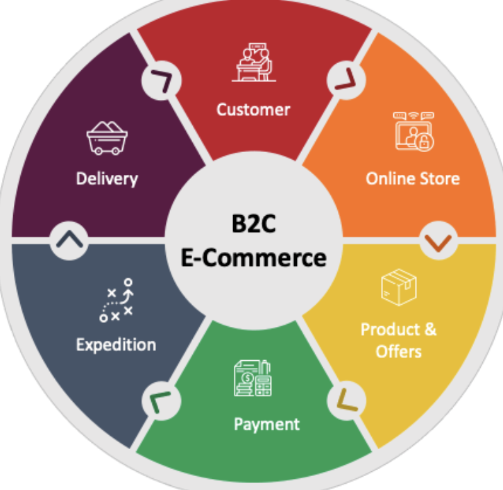
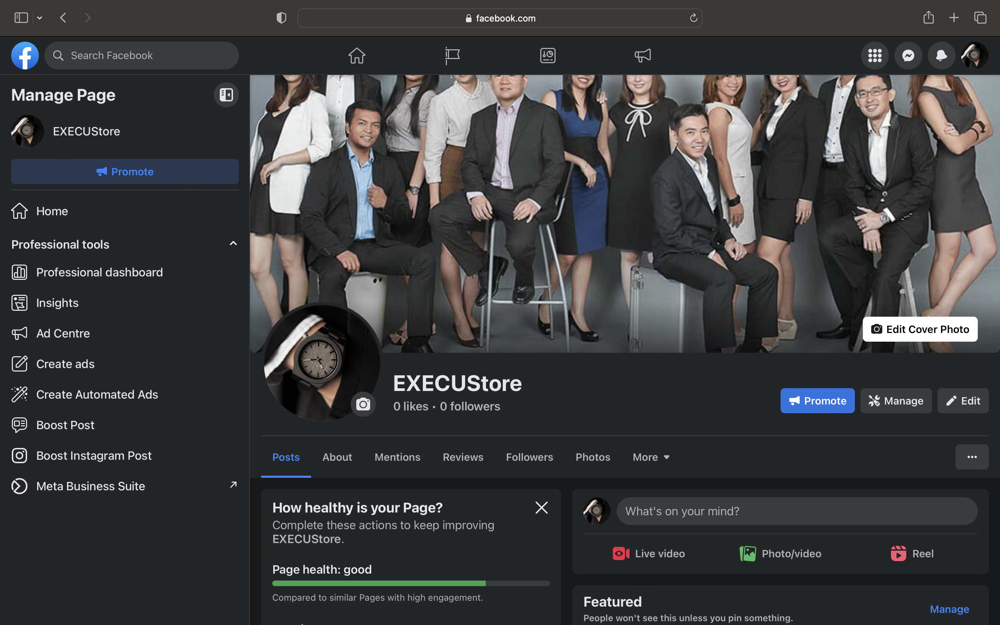
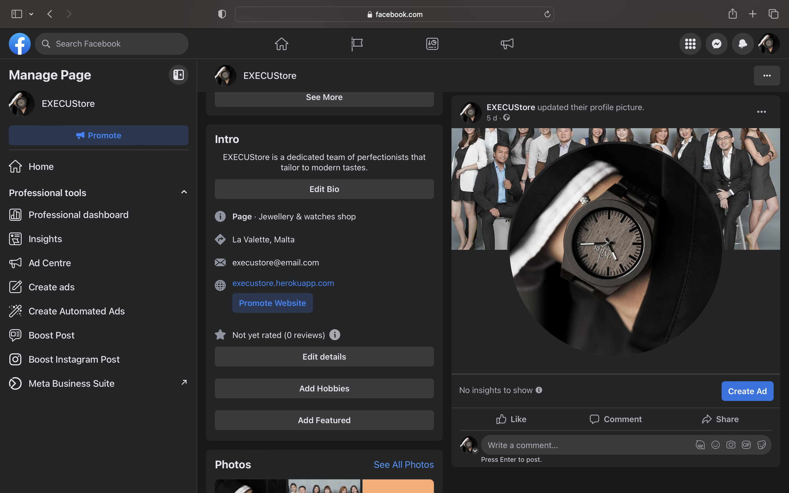
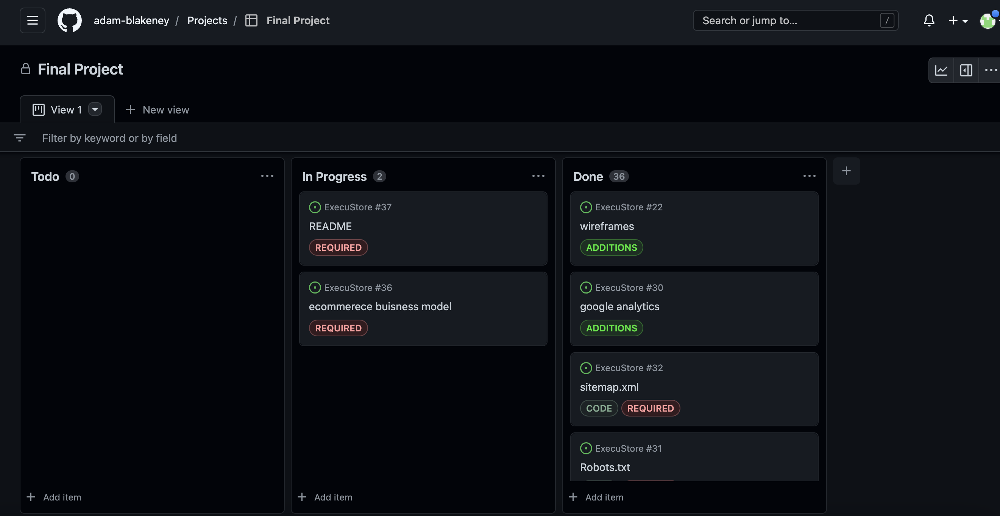
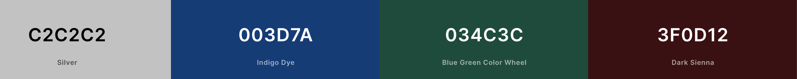
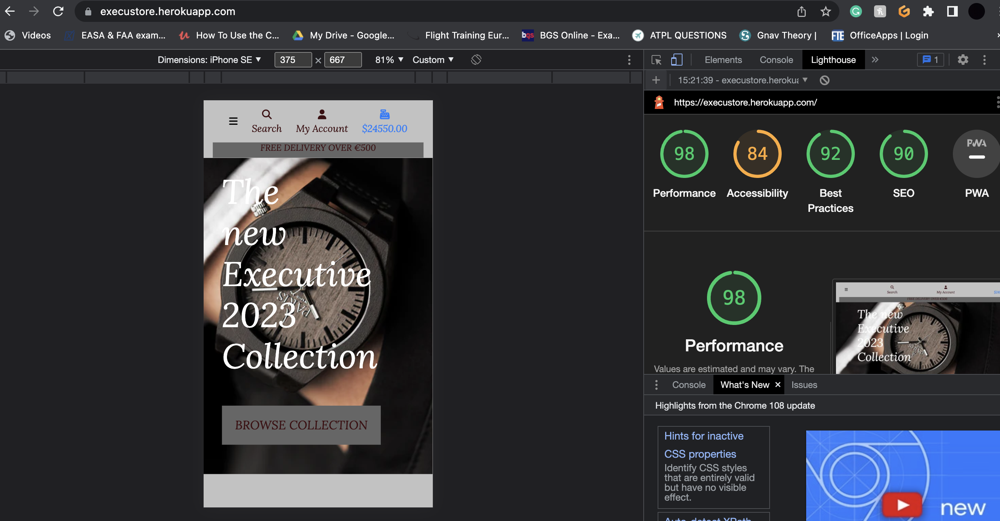
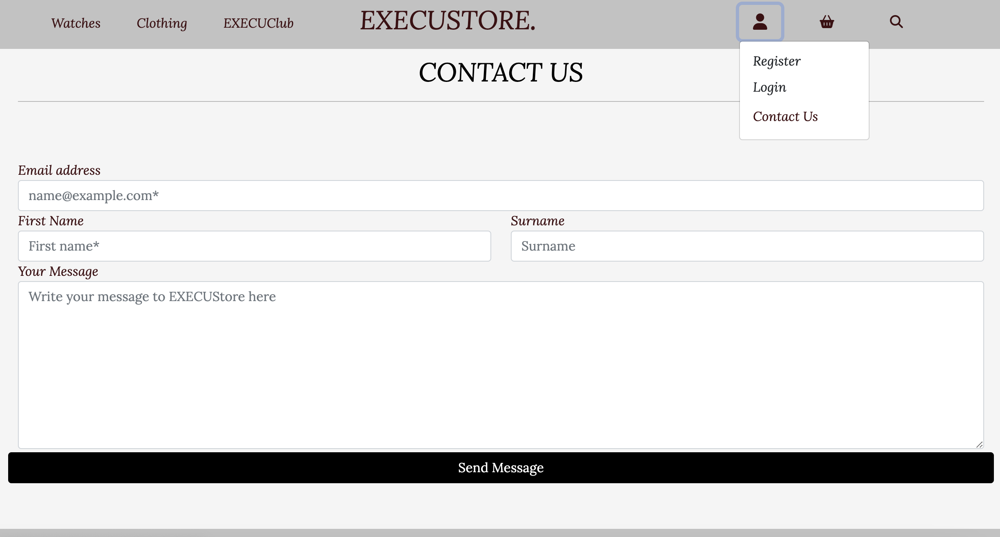

# **MS5 - EXECUStore**

## **[View the Live Website Here!](https://execustore.herokuapp.com/)** ##

## **Code Institute Milestone 5 Project - Full Stack Frameworks Django**
The project has been undertaken to build an efficient, simple and accessible online retail website. The site will enable users to purchase products, register as a user and access user only content. The site will also be fully functioning with payment application stripe.

The project is based around a fictional high end goods supplier. Aimed at the consumer looking for luxury tailored goods. The company is called EXECUStore and supplies high end goods from suits to wathces.

The structure for the site is focused on an ecommerce site that is fully functioning with user authentication and a payment process. The site is designed to be fully responsive and function on a wide range of devices.

# Table of Contents:

# **UX**
## User Stories
----------------
In this project there are three groups of target users. They include user, the admin and members. The user stories for each group are defined below.

__Applicable to all users__
- As a user, I want to be able to quickly understand the purpose of the site
- As a user, I need to be able to navigate around the page in a standard format
- As a user, I would like to see products that I can purchase without signing up to become a member of the page
- As a user, I would like to know where the company is based and the team behind it.
- As a user, I require the ability to see my cart, how much the total about is and what products have been added.
- As a user, the ability to purchase my products safely is a necessity. 
- As a user, I require the need to be able to use the site on mobile, tablet and desktop.
- As a general user, I would like to still have the option to follow the link to buy without registering an account.

__registered user__
- As a registered user, I require access to a profile where I can see my order history.
- As a registered user, I need a seamless ability to sign in and log out.
- As a registered user, I want to be able to save my info so I dont need to re-enter for future orders

__Admin Users__
- As a Super-user, I require the ability to edit, add and delete products for sale and listings.
- As a Super-user, I need to add to be able to access orders. 

## Business Model
----------------
My business is based are the B2C business model. 
- What is B2C?
Business to Consumer (B2C) is the method of doing commerce where businesses trade and transact directly with end customers who buy the product for consumption.

- EXECUStore is a product based B2C company. So witht his in mind what are our marketing strategies and intentions?

- Our intentions and ethos
EXECUStore is primarily foccused on offereing customers not only the higest end products made in the most sustainable way and with the most sustainable materials. It also aims to offer the best purchasing experience for the customer. We aim to give the consumer a very tailored experience and attempts to bring the personality back into e-commerce.

- Our marketing stratigies
EXECUStore impliments the use of social media as the main source of marketing. It does so for 2 reasons, as it is very low cost and with a huge audience it is also directly managable. Unlike paid advertisment companies which can be very expensive and when you stop paying for the service the marketing completely stops with socail media it can still run in the background although it is better to keep a fresh upto date approach with this.
Here is EXECUStores Facebook page which can also be found in the sites footer.

## Strategy
----------------
__Project goals__

The aim of this project is present the company products in a simple and clear but professional way. It was important to create a user-friendly and approachable site with a modern design and feel. The products have to be presented in a clear and familar way. This makes the site more accessible to users who are new to the site and need to find information quickly.

The features and content of the site therefore had to include;
- Product Titles, Descriptions and Prices.
- Familar genres and types.
- An approachable user interface and registration/login functionality.

__User goals__ 

The user goals will be met by enabling the user get access to the products, purchasing and blogs in a clear and concise format. The users require the ability to quickly search for their topic and filter out the irrelevant information. The users goals will be achieved through a landing page featuring nav links, a search element and registration/login option.

## Agile tool
- I used agile as a process in creating this site , Agile methodology is a “step by step” dynamic focused on short-term visibility but never losing the long-term product goal.
- I follwed the kanban method, the Kanban method is organised on a Kanban board, divided into columns, showing every flow within the software project. As the development evolves, the information contained in the table changes, and whenever a new task comes into play, a new “card” is created.
- You can find my kanban board in the following link [here](https://github.com/users/adam-blakeney/projects/2/views/1).

## Scope 
----------------

The site will be built for purpose and the content should be accesible and user friendly. The scope therefore includes:
- A landing page featuring nav links and topics clearly displayed.
- The ability to learn about the company and what products available.
- An ability to search from the landing page, access a user profile and login/register.
- A log in function where the user inputs username and password.
- A register function, the user will input specified details and create a profile.
- A profile page, displaying the order history of the user and the previous saved shipping detail.
- An ability to add products to cart and checkout safely and securley.

## Structure
----------------

The structure of the site is built around the main landing page where the user can navigate and search through the page.

1. **Landing Page**
- Simple landing page, with feature image.
- A navbar that directs users to product pages, blogs and profiles.
- Nav elements will also have a search and current cart element and profile.
- The footer of the page will diplay some info about the company and further nav elements to social media and map etc.
2. **Log In/Register Page**
- This page enables the user to input a username and password.
- The page will link to a register page where the user can register details.
3. **Profile Page**
- This page displays the user profile with their order history and shipping details.
4. **Products Page**
- This page displays filtered products and enables the user to click to find out more information.
- The product cards will show images and names and pricing.
5. **Products Detail**
- The detail page will display product descriptions and pricing.
- This page will enable the user to add the product to their cart and select quantity.
- The detail will also display if the product is in stock or not.
6. **Checkout Page**
- The checkout enables the user to pay for their items and add shipping details relevant to their order.
- This will be a safe secure checkout using stripe.
7. **Blog Page**
- The EXECUClub will display only to users who are registered.
- The content will be a way to create a communtiy and advertise the comapny

## Admin 
- I set up my admin panel to allow editing, adding and removing of products and the categories.

## Custom 404 
- I altered the error page into my custom 404 page with an aim to help the user get back to the main page of the site to help retain users.

## SEO
----------------
1. **Keywords**
- This was my list of short-tail words to begin my SEO
- (Watches, suits, shirts, clothes, hats, glasses, belts, work clothes, formal, Executive clothes, Timeless)

- This was my list od long-tail key words
- (Clothes for office work, formal event clothes ideas, Luxury clothes presents, shirts for office,
    gift ideas for work, suit and shirts for weddings)

- My SEO keyword list for EXECUStore is:
  Executive clothes, formal event clothes, luxury clothes, office attire.

2. **Implementation**
To implement my SEO words, you will see a repetiton of these words implemented through the site. But i wanted ot avoid "stuffing" and over repetition, so I have kept the implemention to a ratio in which the words can be caught but doesnt ruin the aesthethic to the users. 

3. **Files**
  I created a sitemap.xml file using [sitemap](https://www.xml-sitemaps.com/)
  and a robots.txt in the root level of my code.

4. **Regeistering**
 I then registered my sitemap with google [here](https://search.google.com/search-console/welcome)

5. **Testing**
  Testing of my SEO can be found in my *testing* chapter below

## Skeleton 
----------------
### **Wireframes** ###

The Skeleton of the project design was built utilising [Wireframes](https://www.Wireframes.com/). 

The overall basic design breakpoints can be seen below:

### **Changes to initial wireframes** ###
A number of design edits were made throughout the project with the purpose of increased userability and clarity. These include:
- The navbar will be consistent throughout the pages and will change depending on screen size but keep the same content.
- The product layout was made more user firnedly being able to display more products at a time.
 

## Surface 
----------------
The site aimed to be dark with bright elements. The colour choice was to be dark so that nothing distracts from the key data and information. The light will be contrasted deep blue icons, white footer elements and a white background product cards.

**Colour Theme**

**Typography**

- The font used for both body and headings is [Lora](https://fonts.google.com/specimen/Lora). This font was chosen for its professionalism and clarity.
I wanted to bring a modern design feel to the site and utilising a font that is widely used was effective.
The site also has 'Sans Serif' as an alternative font.
- The main logo or title is [Playfair](https://fonts.google.com/specimen/Playfair)

# **Features**
----------------
## 1. Landing Page
-----------------
- The landing page features a feature image with an introduction to the site. The page features a modal search bar to enable users to search through the site. The page has the nav bar which includes, products tab , accounts tab for registration ,login or logout. It also includes the cash register icon to show the amount items reserverd will cost and gives access to the users bag.
On mobile screens this becomes a dropdown menu with burger icon.

----------------------
## 2. Profile Page
----------------------
- The profile page features the users order history and shipping details that are previously used. There are options for the user to edit their details and save for future use.

---------------------
## 3. Login and Register Features
---------------------
- The login page is simple and displays prompts for the user to input their username/email and password. The site also features a link to register if the user has not yet done so. The registration page is simple and prompts username and emails, as well as passwords.
---------------------
## 4. Products, Detail and Bag Page
---------------------
**Products**
- The products page features product cards that display the products information and pricing. The site is fully responsive and also features a filter element so that users can filter from most expensive or A-Z etc.
- Each product links to their product detail page.

**Product Detail**
- The product detail page features an larger image along with a description and then a breakdown of products details.
- This page enables the user to add a product to their cart or select how many and navigate to continue shopping.

**Bag**
- The bag page displays the items and amount the user has placed in their bag.
- There is the ability to add more quantity to the products or remove.
- The total cost is displayed, along with shipping costs and indivdual costs.
- The page links to a secure checkout powered by stripe.

---------------------
## 5. Checkout Page
---------------------
- The checkout is a secure page with a payment form and a stripe function.
- The card input element will display red if there is a card error or green if the card is accepted.
- The user can also go back and adjust their bag if needs be.

---------------------
## 5. Blog Page
---------------------
- The blog page is an interactive page for the users to post and get involved with the communtity and company.

# **Technologies**
## Database
---------------
For my database i used the ElephantSQL tiny turtle package database.

The database model is extended from Django-Allauth, which enables user authentication, email and password verification functionality.

The database functionality: 
- Registered users and emails feed into the User profile.
- Models for genres, condition, category are linked to the products.
- Once an order is created the user profile and product data is linked in the orderline item.

The content is broken down in clear descriptions with text inputs from the forms. The images are uploaded directly. The naming convention was kept concise and relevant to the site.

CRUD functioality design for database.
What is CRUD?

- Create, or add new entries
- Read, retrieve, search, or view existing entries
- Update, or edit existing entries
- Delete, deactivate, or remove existing entries

This can been seen in my project in the product management page and also in the blog page. Where admin and users can create a blog, edit that blog, search for old blog, edit and update their blogs and the delete their blog posts.

## Languages
---------------
For this project these languages were used:
- [HTML](https://www.w3schools.com/html/)
- [CSS](https://www.w3schools.com/css/)
- [Javascript](https://www.javascript.com/)
- [Python](https://www.python.org/)

## Libraries, Frameworks and Technologies
---------------

- [Bootstrap](https://bootstrap.com/) - Bootstrap was used to for its easy to use grid and repsonsive layout.
- [Coolors](https://coolors.co) - Used to create my own colour palette.
- [Google Fonts](https://fonts.google.com/) - Google font 'Lora' was included in the project.
- [Font Awesome](https://fontawesome.com/) - All icons used throughout the project come from fontawesome.
- [JQuery](https://jquery.com/) - Used for aspects of userability.
- [Django](https://www.djangoproject.com/) - The main build of the site is around Django.
- [Mock-Up Generator](https://mockup.photos/) - Used for title photo.
- [Heroku](https://id.heroku.com/login) - Used for site deployment.
- [AWS](https://aws.amazon.com/) - Used for file storage.

## Workspace and Version Control
--------------------
- [Github](https://github.com/) - The project is hosted on Github and the live website is worked through Github pages.

- [Gitpod](https://www.gitpod.io/) - The project used Gitpod IDE for build and development. 

# **Testing**

## User Stories

# Site user:

- Easily use and understand the website.
    The website has a pretty standard UI (user interface), which makes it easy for people to use.
- Create account where they can see their orders.
    With the help of allauth, the user can create an account, and on the "profile" page the users can see their previous orders.
- See products available. Including status and options.
    The products page shows which products exist and all the product description. If the user is logged in, they can also add a product to their bag.
- Add and remove products in the cart.
  The user can add products to the cart from the product_details page. They can edit the items in their bag on the "bag" page.
- Search for products.
    The user can search for products through the search-bar modal. When this is done, the program searches for matches in the product database and only the products with a match to the search term shows up.
- Navigate categories and get relevant results.
    In the shop dropdown the user can choose to either show all products, or show the products in a specific category. Either clothing or watches and these can be sorted using the sort feature.
- Pay for products.
    This e-shop uses stripe for payments. The user write their card info, and stripe handles the transaction.

# Admin user:

- Add/edit/remove products.
    Through the admin page the admin has the option to easily add, edit and delete products. They just need to input the information about the product and add the product in the sel explanitory fields. 
- See and cancel orders Change stock availabiltiy.
    On the page where the admin can manipulate the products, there is a field for each product called "availability". Here the admin can input the available stock.

## Code Validators 
---------------
A number of code validation techniques were utilised to ensure proper testing of site. 
For HTML and CSS, I used the [W3C Markup Validator](https://validator.w3.org) and
[W3C CSS Validation Services](https://jigsaw.w3.org/css-validator/). 
See below for results.

- HTML: All sites pass validation.
- CSS: No errors. 

## Javascript
--------------
A combination of [JSHint](https://jshint.com/) and manual testing was completed on the javascript to ensure adequate quality. 
- No errors found in manual test. 
Basic javascript from Code Institute Boutique Ado project.

## Python
--------------
Python was manually tested and functioned well. Some indentation issues and line length issues arose.

Please note the line-length and indentation issues have been fixed where possible, however, for clarity and ease of use some line lengths have been left to be greater than the standard 79 character limit. Please note that this is done for readability and productivity. Where possible they have been edited to be PEP8 compliant.

## Responsive Elements 
--------------

The responsivity of the page was tested primarily using [Google Chrome Dev Tools]() and manual resizing of windows. The test provided positive results for each device option. The responsive breakpoints and resizing worked throughout the site. The site was shared with colleagues and friends and tested on their devices. The site worked well on all devices tested and there was no problem with browser compatibility found during these tests.

  
## Manual Testing
--------------
Manual testing was completed and the following results were found:

  - Tested the models by creating instances. This was to make sure the fields looked and worked as expected.
  - Tested if the database and the frontend was propperly connected by trying to show part of the data in the frontend.
  - Made sure the search bar works by searching with various key words and ensuring that only expected products showed up in results.
  - For the add to bag and remove from pag i used "print to console" method so i could see my code was carrying out the desired result.
  - The checkout delivery forms system was tested similarly. but also i checked it was not possible to access it with an empty shopping bag. I did that by trying to go to the checkout without anything in the bag.
  - The payment system was tested by making trial payments with the Stripe "test card". After making the test payment, I checked on the dashboard to see if it went thru without issues or, if not, what the issue was.
  - I tested if the toasts worked as expected by performing acctions that should trigger them (e.g adding an item to the bag). I made sure all toasts would display for right trigger. There is an associated bug with this.
  - To test the 404 page, I changed DEBUG to False and tried to go to a non existent extention.
  - I tested all the front end admin functionality by trying to use it. As an example, i created a product, edited it, and then deleted it. I made sure the order information and messages showed up where they should and when they should by trying to get access to them both logged in and logged out. I also tried it as an admin user, and as a standard user.

## Bugs
During the creation of my e-commerce site i encounted alot of issues and bugs here are a couple noteable ones.
- Toasts 
  When i upgraded my bootstap verion my toasts stopped working, i found work around code for this but then seen that my close button was clunky looking and didnt work. At this point i decided to assess my options. I could try and fix the close button and then use CSS to make it look better but i came to the conclusion that the close button is more of a hinderance to the user so i used a fade function to close the toast automatical after an approptriate time.
- Increment Decrement Buttons
  I ran into an issue where on my bag and product detail page my +- buttons were either not functioning at all or either would let a negative amount of product be selected. This was a very difficult fix for me and it came down to use of classes and ids.
  

## SEO testing
I tested my robots.txt file using this google console [site](https://support.google.com/webmasters/answer/6062598?hl=en) and corrected any erros in the file.

## WEBSITE testing
- I used google lighthouse to analyse and audit my site and here are the results.

## UX User Story Test
--------------
The user stories previously laid out in the UX Design section are tested, to ensure that project achieves the user goals.

__Applicable to all users__
- As a user, I want to be able to quickly understand the purpose of the site.
  - The user lands on an informative site.
- As a user, I need to be able to navigate around the page in a standard format.
  - The nav bar is clear and structured in a familar format.
- As a user, I would like to see products that I can purchase without registering.
  - I can view all products without registering an account. 
- As a user, I would like to know where the company is based and the team behind it.
   - A brief introduction to the team is clear in the footer along with a map to location.
- As a user, I require the ability to see my cart, how much the total about is and what products have been added.
  - I can see my cart and the total amount and alter it
- As a user, the ability to purchase my products safely is a necessity. 
  - The secure checkout functions properly.
- As a user, I require the need to be able to use the site on mobile, tablet and desktop.
  - The site a has good responsive elements.

__General user__
- As a general user, I require to be able to view and use elements of the site without logging in.
  - I can view all core elements of the site without the need to log in.
- As a general user, I would like to still have the option to follow the link to buy without registering an account.
  - I can purchase products without being a member of the site. 

__Registered User__
- As a registered user, I require access to a profile where I can see my order history.
  - I can see order history and shipping details.
- As a registered user, I need a seamless ability to sign in and log out.
  - I can log out and log in with minimal effort

__Admin Users__
- As a Super-user, I require the ability to edit, add and delete products for sale and listings.
  - Admin has full CRUD functionality.
- As a Super-user, I need to add to the EXECUClub post section. 
  - Admin can add, edit, update, delete a blogpost.

# Deployment 

The following section shows a brief overview of project deployment. For more in-depth review please refer to the relevant documentation. 

## Heroku Deployment:
# Publishing 
- Create an account at Heroku.
- Create a list of dependencies in a text file named requirements (pip3 freeze > requirements.txt).
- Create an app by clicking the "create a new app" button found on the dashboard.
- Choose your region and click "create app"
- Find the Config Vars section and add potential files that you cannot upload to github. For        
  example API credentials.
- Add buildpacks (below Config Vars)
- Choose to deploy from GitHub.
- Connect your account and choose a repository to deploy from.
- Choose either Automatic deployment.
- Add DISABLE_COLLECTSTATIC as a Cvar.

## Heroku Deployment:
This project is deployed using Heroku.

1. ### Requirements and Procfile
- In the GitPod terminal, type pip3 freeze --local > requirements.txt to create your requirements file.

2. ### Creating Heroku App
- Log into Heroku
- Select 'Create New App' from your dashboard
- Choose an app name
- Select the appropriate region based on your location
- Click 'Create App'

3. ### Connecting to GitHub
- From the dashboard, click the 'Deploy'
- Go to 'Deployment Method' and choose 'GitHub'
- Locate your repository by name , click 'Connect'
 
4. ### Environment Variables
- Click the 'Settings' tab towards the top of the page
- Go to 'Reveal Config Vars':
  - Input your relevant variable names.
- The Config Vars are as follows:
  - DATABASE_URL (Database URL)
  - SECRET_KEY (secret key)
  - STRIPE_PUBLIC_KEY (Stripe public key)
  - STRIPE_SECRET_KEY (Stripe secret key)
  - STRIPE_WH_KEY (Stripe webhook key if using)
  - USE_AWS (set True)

## ElephantSQl setup:
- Create an account on ElephantSQL. Do not forget to confirm your e-mail.
- Click on "create a new instance" (it is a green button at the top right corner).
- Give the information about the instance.
- Choose a plan (tiny turtle is free).
- Select a region and data center. 
- Create instance.
- Copy the url and add it to the Config Vars as DATABASE_URL.
- Migrate the models to the database.

## AWS Set Up:
The static files and images are hosted via AWS using the following steps. Note this is an overview. For more indepth detail please follow the steps provided via the links.

- Sign up and set up for [AWS](https://aws.amazon.com/).
- Create AWS S3 Bucket, with a bucket and access policy, featuring a user and group. Please follow the outlined instructions [here](https://docs.aws.amazon.com/AmazonS3/latest/userguide/GetStartedWithS3.html).
- Django and AWS Database can be connected via the information provided [here](https://django-storages.readthedocs.io/en/latest/backends/amazon-S3.html).
- Once this process is complete add the AWS_ACCESS_KEY_ID and AWS_SECRET_ACCESS_KEY to the Heroku config vars.

Please note this is an overview of AWS set up. Please refer to the [AWS S3 Documentation](https://docs.aws.amazon.com/s3/index.html) for further insight.

# **Credits**
## Content
--------------
 - The project backend structure came from the Code Institute Boutique Ado Project.
 - The structure of the site from Bootstrap.
 - All images for products come from google search of high quality images.
 

## Media 
--------------
- All icons were sourced from [font awesome](https://fontawesome.com/)

## Acknowledgements
-------------- 
Thanks to the [Code Institute](https://codeinstitute.net) for the tutorials and resources. 
- Especially all the amazing Tutors at CI for their patience and help:)

# Latest Update 3/23
## Contact Form

-On recomedation of adding more custom models to my project i decided to add a contact form to my page as it falls inline with the model of my site with adding to the possibilty of letting the custom get a more custom experice and making it easier for them to speak to the tailors directly.

-How it works.
The user clicks on the contact form in the profile drop down.
The user fills out the form.
The user clicks send message, and they will recieve a message either being success or failure.
The site owners go into the admin section and go to the contact section where all the details will be there.
This allows all staff members to view the message and get the email to respond to the customer.

